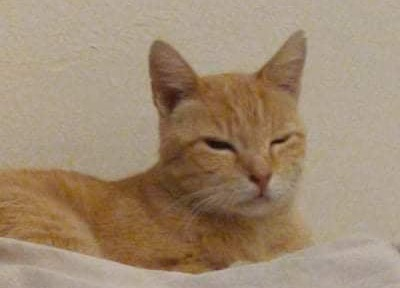

# About Myself

**Kaiwen Tsou** is a computer engineering student at UC San Diego. [This GitHub hosts most of his projects so far](#my-projects). In his free time, he competes in collegiate Speech and Debate tournaments, plays CRPGs or DDR, and plays with his cat, Gary (pictured below). 


<!--- Okay, this is a comment, you shouldn't see this! -->


```
meow, i'm *gary*
```

>That's something Gary would *probably* say

I used [VSCode](https://code.visualstudio.com/) to make this page.


## My Projects

For this assignment, you can find all the [screenshots here](./../screenshots).

Here are some projects you can find on my GitHub

- This one
- Not any others, really

And here they are in reverse order, and now numbered

1. Not any others, really
2. This one

Page 
- [x] Create this document
- [x] Post to GitHub Pages
- [ ] \(Optional) Make sure emoji's render :tada: